# Shortlytics 🔗📊

**Shortlytics** is a containerized URL-shortening and analytics platform built to demonstrate full-stack development together with cloud infrastructure, Kubernetes deployment, GitOps, secrets management, and application observability.

The application lets an authenticated user create short URLs, manage their links, and inspect click activity over time. The platform is designed as a **two-tier application (frontend + backend) backed by PostgreSQL**, deployed on **Azure Kubernetes Service (AKS)** and provisioned with **Terraform**.

> **Project positioning**
>
> This repository is intentionally presented as a practical Cloud/DevOps portfolio project. The current application is not a collection of independent business microservices: the backend is a single Spring Boot service. Kubernetes, Terraform, GitOps, security, and observability are used around that application to demonstrate production-oriented engineering practices.

---

## ✨ What the project demonstrates

| Area | What is demonstrated |
|---|---|
| Application development | React/Vite frontend + Spring Boot REST API |
| Authentication | Spring Security + JWT + BCrypt password hashing |
| Persistence | PostgreSQL + Spring Data JPA |
| Database evolution | Flyway migrations |
| Containerization | Multi-stage Docker builds |
| Orchestration | Kubernetes on AKS |
| Infrastructure as Code | Modular Terraform |
| GitOps | Argo CD + Git-managed Kubernetes configuration |
| Secret management | Azure Key Vault + External Secrets + Workload Identity |
| Observability | Spring Boot Actuator + Micrometer/Prometheus |
| Reliability | Kubernetes readiness/liveness probes + graceful shutdown |

---

## 🏗️ Architecture at a glance

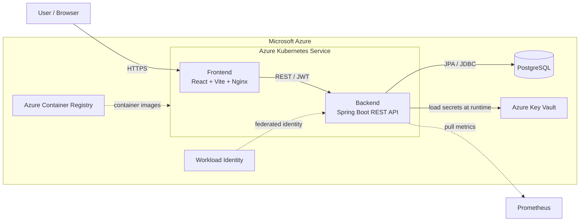

### Main request path

```text
Browser
   │
   │ HTTPS
   ▼
Frontend (React / Nginx)
   │
   │ REST API + Bearer JWT
   ▼
Spring Boot Backend
   │
   ├── Spring Security / JWT
   ├── Service layer
   ├── Spring Data JPA
   │
   ▼
PostgreSQL
```

The deployed application is deliberately split into **application runtime** and **infrastructure/deployment management**:

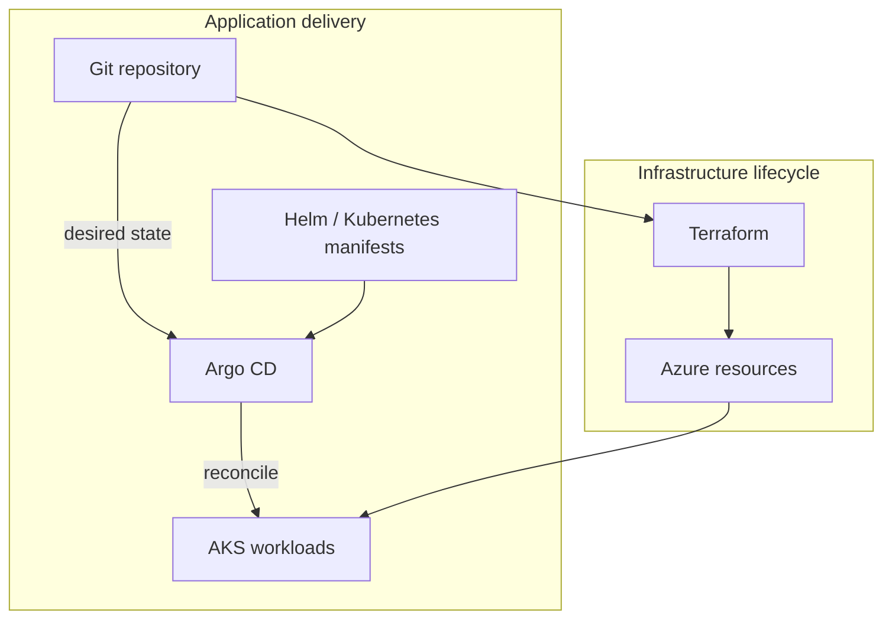

**Key separation:**

- **Terraform** provisions Azure infrastructure and identity dependencies.
- **Argo CD** reconciles Kubernetes application state from Git.
- **Kubernetes** runs the frontend and backend workloads.
- **PostgreSQL** stores users, short URLs, and click events.

---

## 🔄 Application flows

### 1. User registration and login

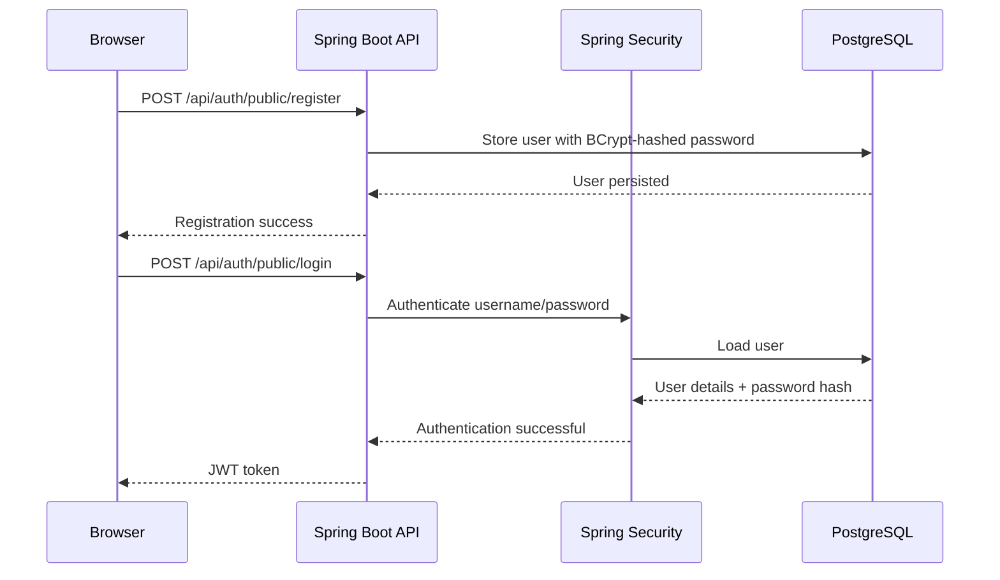

The backend exposes public authentication endpoints under `/api/auth/public/*`. User registration assigns the `ROLE_USER` role, while the login flow authenticates through Spring Security.

### 2. Creating a short URL

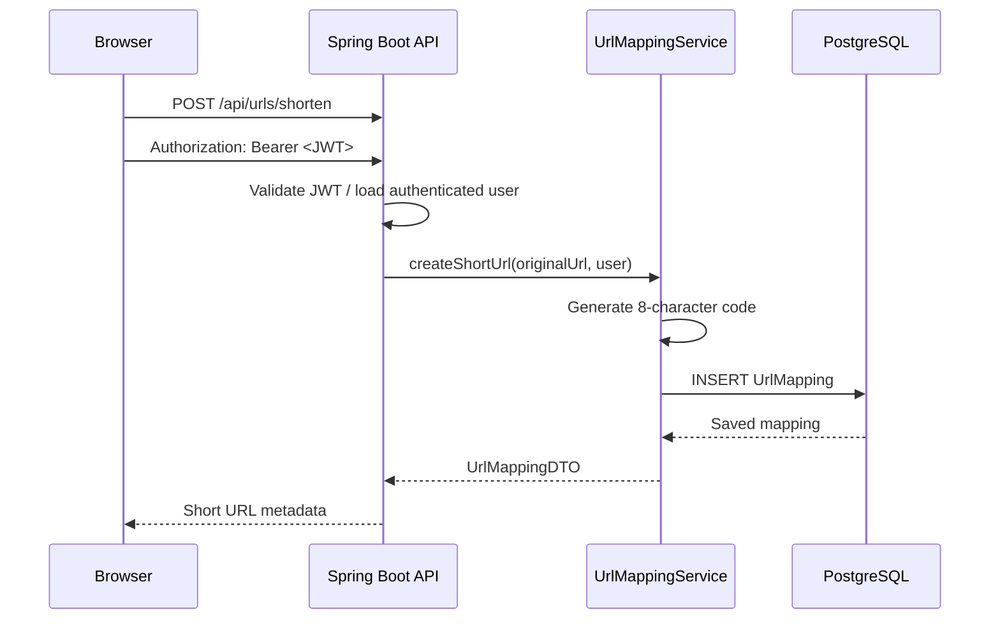

The current implementation generates an 8-character alphanumeric code and persists it together with the original URL, owning user, and creation timestamp.

### 3. Following a short URL

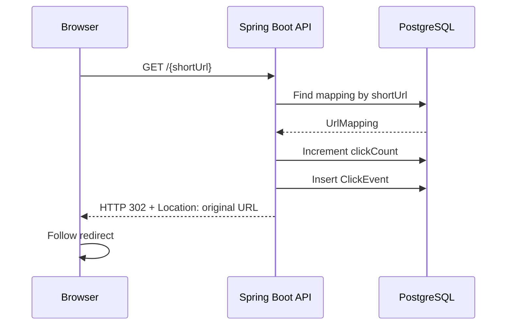

The redirect endpoint is intentionally public: the short URL itself is the public resource. When a mapping exists, the backend increments the counter, creates a click event, and responds with HTTP `302` and a `Location` header.

### 4. Analytics retrieval

```mermaid
flowchart LR
    DASH[Dashboard]
    API[GET /api/urls/analytics/{shortUrl}]
    REPO[ClickEventRepository]
    DB[(PostgreSQL)]
    AGG[Group events by calendar date]

    DASH --> API
    API --> REPO
    REPO --> DB
    DB --> REPO
    REPO --> AGG
    AGG --> API
    API --> DASH
```

Analytics requests are filtered by a date range and the current service groups returned click events by calendar date before producing DTOs for the frontend. Total clicks for a user are handled through a separate endpoint that queries events across the user's URLs.

---

## 🔐 Authentication and authorization

Shortlytics uses **Spring Security + JWT**.

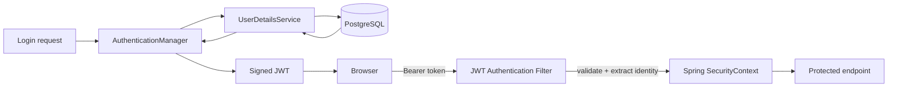

### Security model

- Passwords are stored using a BCrypt hash rather than plaintext.
- Protected URL-management endpoints require the `USER` role.
- JWTs carry the authenticated identity/role information used by Spring Security.
- The redirect endpoint is public so that anonymous visitors can resolve a short link.
- Runtime secrets are supplied through environment variables and the cloud secret-management path rather than being hard-coded in application source.

---

## 🗃️ Data model

The core domain contains three entities: `User`, `UrlMapping`, and `ClickEvent`.

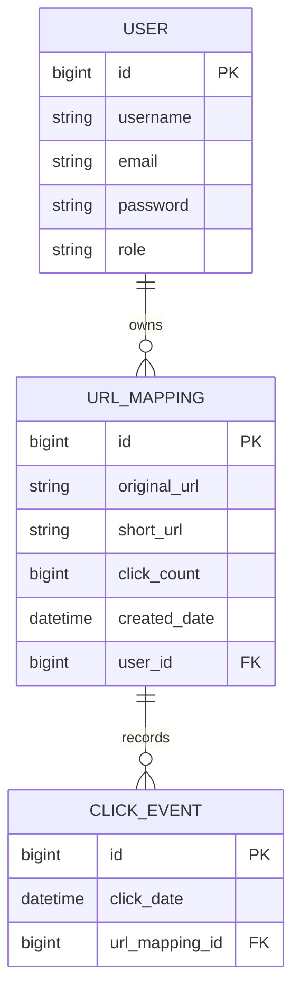

### Why keep both `clickCount` and `ClickEvent`?

`clickCount` is a convenient aggregate for quick display, while `ClickEvent` preserves the history required for time-based analytics.

This is a deliberate denormalization trade-off: the counter is derived state and must remain consistent with recorded events. At larger scale, the redirect path and analytics ingestion would be good candidates for further decoupling.

---

## 🧩 Backend architecture

The backend follows a classic layered Spring Boot structure:

```text
HTTP request
     │
     ▼
Controller
     │
     ▼
Service / business logic
     │
     ▼
Repository
     │
     ▼
JPA / Hibernate
     │
     ▼
PostgreSQL
```

### Main backend responsibilities

| Layer | Responsibility |
|---|---|
| Controller | HTTP endpoints, request parameters, authorization annotations, DTO responses |
| Service | URL generation, user operations, click recording, analytics aggregation |
| Repository | Persistence operations through Spring Data JPA |
| Model | JPA entities representing users, URL mappings, and click events |
| DTOs | Data transferred between backend and frontend without exposing the entity model directly |
| Security | Authentication, JWT validation, and role-based authorization |

The application uses Spring Boot 3.4, Java 23, Spring Web, Spring Data JPA, Spring Security, PostgreSQL, Flyway, JJWT, Actuator, and Micrometer Prometheus support.

---

## 🔗 API overview

### Authentication

| Method | Endpoint | Auth | Purpose |
|---|---|---|---|
| `POST` | `/api/auth/public/register` | Public | Create a user account |
| `POST` | `/api/auth/public/login` | Public | Authenticate and receive a JWT |

### URL management

| Method | Endpoint | Auth | Purpose |
|---|---|---|---|
| `POST` | `/api/urls/shorten` | `ROLE_USER` | Create a short URL |
| `GET` | `/api/urls/myurls` | `ROLE_USER` | List URLs owned by the authenticated user |
| `GET` | `/api/urls/analytics/{shortUrl}` | `ROLE_USER` | Retrieve click analytics for one short URL |
| `GET` | `/api/urls/totalClicks` | `ROLE_USER` | Retrieve total clicks by date for the user's URLs |

### Public redirect

| Method | Endpoint | Auth | Purpose |
|---|---|---|---|
| `GET` | `/{shortUrl}` | Public | Resolve the short URL and issue a `302` redirect |

These routes are implemented by the authentication, URL-management, and redirect controllers.

---

## 🐳 Containerization

Both frontend and backend use multi-stage Docker builds.

### Frontend image

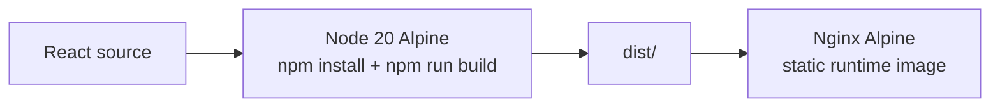

The final frontend image does not need Node.js at runtime; it only serves the built static files with Nginx.

### Backend image

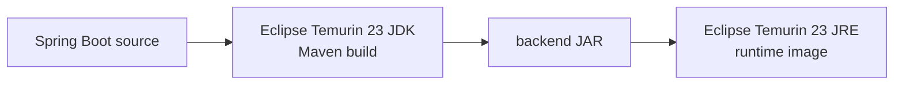

The backend build stage compiles the application with Maven, then the final image contains only the JRE plus the generated JAR.

---

## ☁️ Azure infrastructure

Terraform is split into reusable modules and environment-specific composition.

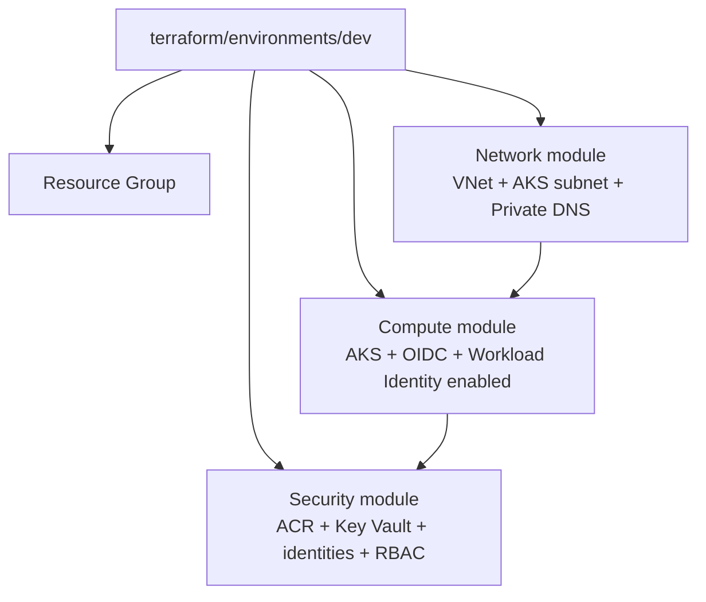

The current development environment composes three modules:

1. **Network** — creates the VNet, AKS subnet, and private DNS zone.
2. **Compute** — creates AKS with OIDC and Workload Identity enabled.
3. **Security & Identity** — creates ACR, Key Vault, a user-assigned identity, federation credentials, and the relevant role assignments.

### Current network layout

The network module defines a `10.0.0.0/16` VNet and a `10.0.1.0/24` subnet for AKS. The AKS subnet has a Key Vault service endpoint, and a private DNS zone is linked to the VNet.

### Current AKS configuration

The current compute module enables:

- OIDC issuer
- Azure Workload Identity
- a system-assigned AKS identity
- Azure CNI networking
- Standard Load Balancer
- a default node pool with one `Standard_D2s_v3` node in the development configuration

The service CIDR is `172.16.0.0/16` and the cluster DNS service IP is `172.16.0.10`.

---

## 🔑 Secret management with Azure Key Vault + Workload Identity

A major security goal is to avoid embedding cloud credentials in application images or Git.

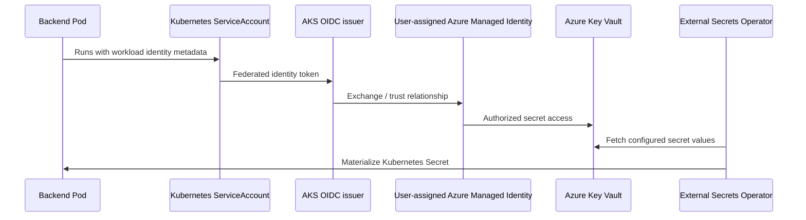

Terraform creates the Azure user-assigned identity and a federated identity credential whose subject maps the identity to the Kubernetes service account used by the application. The identity receives the **Key Vault Secrets User** role, while the AKS kubelet identity receives **AcrPull** on the container registry.

This gives the platform two distinct identity paths:

```text
AKS kubelet identity  ──> ACR (AcrPull)

Backend workload identity ──> Key Vault (Secrets User)
```

---

## 🔄 GitOps deployment model

The intended deployment model is declarative:

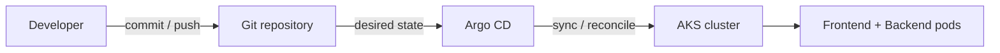

Instead of manually applying application manifests every time, the repository becomes the source of truth for the desired Kubernetes state. Argo CD continuously reconciles the cluster against that state.

This is conceptually different from Terraform:

```text
Terraform
  └── Azure infrastructure

Argo CD
  └── Kubernetes application state
```

---

## ❤️ Health checks and graceful shutdown

The backend exposes Spring Boot Actuator health/metrics endpoints and enables liveness and readiness probes.

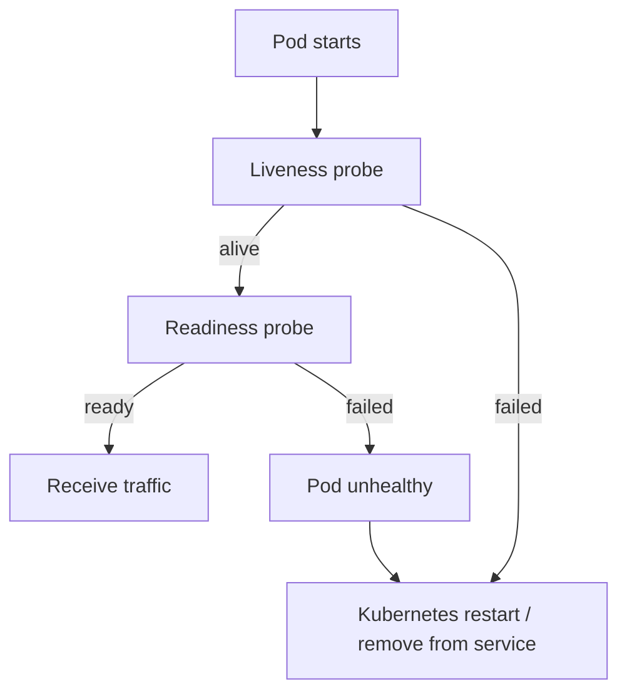

The application enables health probes through Actuator and configures graceful shutdown with a 20-second shutdown phase.

This gives two useful operational semantics:

- **Liveness:** is the process still alive?
- **Readiness:** should the service receive traffic right now?

---

## 📈 Observability

The backend includes:

- Spring Boot Actuator
- Micrometer Prometheus registry
- health endpoints
- liveness/readiness probes
- Prometheus metrics exposure
- structured application logging configuration

The enabled Actuator endpoints are `health`, `metrics`, and `prometheus`.

A typical production evolution would be:

```text
Spring Boot
    │
    ├── /actuator/health
    ├── /actuator/prometheus
    │
    ▼
Prometheus
    │
    ▼
Grafana dashboards
```

---

## 🗂️ Repository structure

```text
shortlytics/
│
├── backend/
│   ├── src/main/java/
│   │   └── com/url/shortener/
│   │       ├── controller/       # REST controllers
│   │       ├── service/          # Business logic
│   │       ├── repository/       # Spring Data repositories
│   │       ├── models/           # JPA entities
│   │       ├── dtos/             # API DTOs
│   │       └── security/         # Spring Security + JWT
│   ├── src/main/resources/       # Application configuration / migrations
│   ├── Dockerfile
│   └── pom.xml
│
├── frontend/
│   ├── src/
│   │   ├── components/           # React views and UI components
│   │   ├── hooks/                # API/data hooks
│   │   └── ...
│   ├── Dockerfile
│   └── package.json
│
├── gitops-manifests/             # Kubernetes / Helm / Argo CD configuration
├── scripts/                      # Deployment and infrastructure helper scripts
│
├── terraform/
│   ├── bootstrap/                # Initial Terraform prerequisites/state setup
│   ├── environments/
│   │   ├── dev/
│   │   └── prod/
│   └── modules/
│       ├── network/
│       ├── compute/
│       └── security/
│
└── README.md
```

The repository currently separates application source, GitOps configuration, automation scripts, and Terraform modules into these top-level concerns.

---

## 🚀 Local development

### Prerequisites

- Java 23 (the project currently targets Java 23)
- Maven Wrapper included in the backend
- Node.js 20+
- npm
- PostgreSQL
- Docker (optional for local container builds)
- `kubectl` and Helm for Kubernetes work
- Terraform for infrastructure work
- Azure CLI for Azure provisioning

### Run the backend

Create/configure the environment variables required by your active Spring profile. The production profile expects:

```bash
export DB_URL="jdbc:postgresql://localhost:5432/url_shortener_db"
export DB_USERNAME="postgres"
export DB_PASSWORD="<password>"
export JWT_SECRET="<strong-secret>"
export JWT_EXPIRATION="86400000"
```

Then:

```bash
cd backend
./mvnw spring-boot:run
```

### Run the frontend

```bash
cd frontend
npm install
npm run dev
```

The repository's development documentation uses the same backend/frontend split and runs the Spring Boot API separately from the React development server.

---

## 🏗️ Infrastructure deployment with Terraform

Terraform uses a bootstrap phase followed by environment-specific deployments.

### Bootstrap

```bash
cd terraform/bootstrap
terraform init
terraform plan
terraform apply
```

### Development environment

```bash
cd terraform/environments/dev
terraform init
terraform plan -out=dev.tfplan
terraform apply dev.tfplan
```

For production, use the equivalent `terraform/environments/prod` configuration.

The environment composition connects the network, compute, and security modules through Terraform outputs and module inputs.

---

## 🛠️ Automation scripts

The repository includes shell helpers for common tasks:

```bash
./scripts/deploy-dev.sh
./scripts/sync-infra.sh
./scripts/setup-argocd-secrets.sh
```

These scripts are intended to reduce repetitive operational commands around development deployment, infrastructure synchronization, and Argo CD-related setup.

---

## ⚙️ Engineering decisions and trade-offs

### Why PostgreSQL?

The domain is relational:

```text
User 1 ──── N URL mappings
URL  1 ──── N Click events
```

PostgreSQL is therefore a natural fit for consistency, relationships, transactional writes, and SQL-based analytics.

### Why Flyway?

Database schema changes should be reproducible and versioned rather than depending on Hibernate to silently mutate a production schema. The production profile uses `ddl-auto=validate` while Flyway is enabled.

### Why multi-stage Docker builds?

The build environment needs compilers/build tools; the runtime usually does not. Keeping those concerns separate produces a smaller and more focused runtime image.

### Why Workload Identity?

It avoids the need for long-lived Azure client secrets in pods and lets Azure RBAC define what a workload can access.

### Why GitOps?

Kubernetes configuration becomes reviewable, versioned, and reproducible. The cluster is reconciled against a declared desired state rather than relying on manual `kubectl apply` as the normal deployment mechanism.

---

## ⚠️ Current limitations and next improvements

This project is deliberately honest about the gap between a strong portfolio implementation and a highly scaled production URL-shortening service.

### 1. Short-code collision handling

The current implementation generates a random 8-character alphanumeric code but does not itself perform a collision-safe retry loop.

A production improvement would be:

```text
Generate code
     │
     ▼
INSERT with UNIQUE(short_url)
     │
 ┌───┴────┐
 │ success│ collision
 ▼        ▼
return   retry
```

### 2. Redirect path writes synchronously

The redirect path currently updates `clickCount` and inserts a `ClickEvent` before returning the `302`.

At higher traffic volumes, analytics should be moved away from the critical redirect path, for example:

```text
Client
  │
  ▼
Redirect service
  │
  ├── fast lookup / cache
  │
  └── publish click event ──> queue ──> analytics worker ──> database
```

### 3. Analytics aggregation

The current implementation loads the relevant click events and groups them in Java.

For larger datasets, database-side aggregation and appropriate composite indexes would reduce application-memory pressure.

### 4. Token storage on the frontend

The current frontend stores the JWT in browser storage. A more hardened production design could use an appropriate `HttpOnly`/`Secure` cookie strategy or another token architecture depending on the deployment model and threat model.

### 5. Dynamic analytics periods

Date ranges should be user-selectable or calculated dynamically rather than being hard-coded in the frontend. This avoids stale analytics windows as time progresses.

### 6. Scale-out

A next iteration could add:

- multiple backend replicas
- Horizontal Pod Autoscaler
- connection-pool tuning
- Redis/cache for hot short-code lookups
- asynchronous click ingestion
- database indexing and/or read replicas
- centralized logging and distributed tracing

---

## 🎯 What I would explain in a technical interview

This project can be presented through five increasingly deep layers:

### Layer 1 — Product

> “Shortlytics shortens URLs and records click activity so users can inspect engagement over time.”

### Layer 2 — Application architecture

> “The frontend is React/Vite, the backend is a Spring Boot REST API, and PostgreSQL stores the domain data.”

### Layer 3 — Security

> “Authentication uses Spring Security and JWT. Passwords are BCrypt-hashed, URL-management endpoints are role-protected, and the public redirect endpoint remains accessible without authentication.”

### Layer 4 — Cloud / DevOps

> “The workloads run on AKS, Azure infrastructure is provisioned with modular Terraform, container images are stored in ACR, and application deployment follows a GitOps model with Argo CD.”

### Layer 5 — Production thinking

> “The current implementation works, but I can identify its scaling boundaries: synchronous analytics writes, application-side aggregation, random short-code collisions, and the need for stronger production token handling. I would address those incrementally based on traffic and reliability requirements.”

---

## 📚 Interview whiteboard summary

If asked to draw the architecture, this is enough:

```text
                           ┌───────────────┐
                           │     User      │
                           └───────┬───────┘
                                   │ HTTPS
                                   ▼
                    ┌──────────────────────────┐
                    │ React / Vite / Nginx     │
                    │ Frontend                 │
                    └────────────┬─────────────┘
                                 │ REST + JWT
                                 ▼
                    ┌──────────────────────────┐
                    │ Spring Boot API          │
                    │                          │
                    │ Security → Controller    │
                    │ → Service → Repository   │
                    └────────────┬─────────────┘
                                 │ JPA/JDBC
                                 ▼
                         ┌───────────────┐
                         │  PostgreSQL   │
                         │               │
                         │ Users         │
                         │ URLs          │
                         │ ClickEvents   │
                         └───────────────┘

       Azure / Platform

   Terraform → VNet → AKS → Pods
                     │
                     ├── ACR (images)
                     ├── Key Vault (secrets)
                     └── Workload Identity

   Git → Argo CD → desired Kubernetes state → AKS
```

---

## 📄 License

Add the project's intended license here once one is chosen and committed to the repository.
