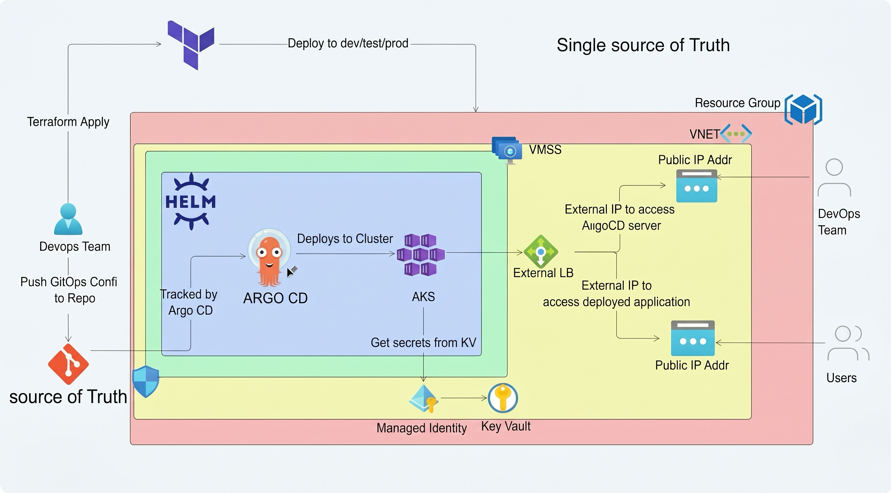

# Shortlytics 🔗📊

URL shortener with click analytics, deployed on Azure Kubernetes Service with Terraform, Argo CD and Azure Key Vault.


## Overview

Authenticated users can create short URLs, manage their links, and view click activity over time. The app is a React frontend and a Spring Boot REST API backed by PostgreSQL, running on AKS. Terraform provisions the Azure infrastructure, Argo CD deploys from Git, and secrets are delivered from Key Vault through Workload Identity, so no cloud credentials are stored in images or in the repo.

## Architecture



- **Terraform** provisions Azure resources and identities.
- **Argo CD** reconciles Kubernetes application state from Git.
- **Kubernetes (AKS)** runs the frontend and backend workloads.
- **PostgreSQL** stores users, short URLs and click events.

## Features

- JWT authentication with Spring Security and BCrypt-hashed passwords
- Short URL creation, link management, and per-URL and total click analytics
- Public `302` redirect that records each click
- Flyway-versioned schema migrations
- Multi-stage Docker builds for frontend and backend
- Health, liveness and readiness probes, Prometheus metrics, graceful shutdown
- Secrets from Azure Key Vault via External Secrets Operator and Workload Identity

## Tech stack

| Layer | Technology |
|---|---|
| Frontend | React, Vite, Nginx |
| Backend | Java 23, Spring Boot 3.4, Spring Security, Spring Data JPA, JJWT |
| Database | PostgreSQL, Flyway |
| Infrastructure | Azure (AKS, ACR, Key Vault, VNet), Terraform |
| Delivery | Docker, Helm, Argo CD |
| Observability | Spring Boot Actuator, Micrometer, Prometheus |

## How to run

### Locally

**Prerequisites:** Java 23, Node.js 20+, PostgreSQL

1. Create a PostgreSQL database named `url_shortener_db`.
2. Set the backend environment variables:

   ```bash
   export DB_URL="jdbc:postgresql://localhost:5432/url_shortener_db"
   export DB_USERNAME="postgres"
   export DB_PASSWORD="<password>"
   export JWT_SECRET="<strong-secret>"
   export JWT_EXPIRATION="86400000"
   ```

3. Start the backend (Flyway applies migrations on startup):

   ```bash
   cd backend
   ./mvnw spring-boot:run
   ```

4. Start the frontend in a second terminal:

   ```bash
   cd frontend
   npm install
   npm run dev
   ```

### On Azure

**Prerequisites:** Azure CLI, Terraform, `kubectl`, Helm

```bash
# 1. Bootstrap Terraform prerequisites (remote state)
cd terraform/bootstrap
terraform init
terraform apply

# 2. Provision the dev environment
cd ../environments/dev
terraform init
terraform plan -out=dev.tfplan
terraform apply dev.tfplan

# 3. Deploy the application through Argo CD
cd ../../..
./scripts/deploy-dev.sh
```

Use `terraform/environments/prod` for production. Other helpers: `scripts/sync-infra.sh`, `scripts/setup-argocd-secrets.sh`.

## API

| Method | Endpoint | Auth | Purpose |
|---|---|---|---|
| `POST` | `/api/auth/public/register` | Public | Create an account |
| `POST` | `/api/auth/public/login` | Public | Log in and receive a JWT |
| `POST` | `/api/urls/shorten` | User | Create a short URL |
| `GET` | `/api/urls/myurls` | User | List your URLs |
| `GET` | `/api/urls/analytics/{shortUrl}` | User | Click analytics for one URL |
| `GET` | `/api/urls/totalClicks` | User | Total clicks by date |
| `GET` | `/{shortUrl}` | Public | Redirect to the original URL |

Protected endpoints expect `Authorization: Bearer <JWT>`.

## Key decisions

- **Workload Identity over client secrets:** no Azure credentials in pods, images or Git.
- **GitOps with Argo CD:** deployments are reviewable commits, and cluster drift is corrected automatically.
- **Flyway with `ddl-auto=validate`:** schema changes are versioned instead of mutated by Hibernate.
- **Both `click_count` and `ClickEvent`:** the counter gives fast display, the events give time-based analytics.

## Known limitations and next steps

- Short-code generation has no collision retry; add a `UNIQUE(short_url)` constraint with retry.
- Click recording is synchronous on the redirect path; move it to async ingestion.
- Analytics are grouped in Java; use database-side aggregation and indexes.
- The JWT is kept in browser storage; consider an `HttpOnly` cookie.
- Analytics date ranges are hard-coded in the frontend.

## Repository structure

```text
shortlytics/
├── backend/            # Spring Boot API
├── frontend/           # React + Vite app
├── gitops-manifests/   # Kubernetes / Helm / Argo CD config
├── scripts/            # Deployment helpers
├── terraform/          # bootstrap, environments (dev, prod), modules
├── docs/architecture.png
└── README.md
